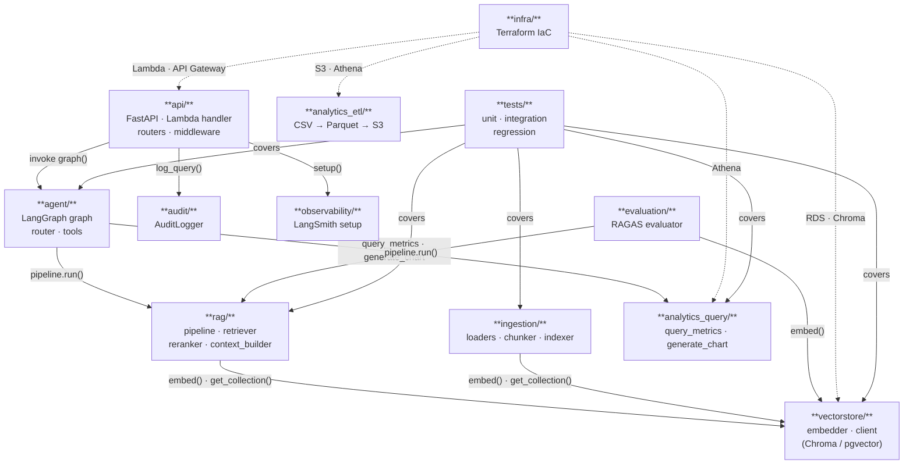

# Folder Dependency Diagram

Code-level relationships between the main folders of the ComplianceRAG repo.

## Notes

- Solid arrows = Python import dependencies
- Dashed arrows = runtime infrastructure provisioned by Terraform (no Python imports)
- `vectorstore/` is the shared DB access layer — both `ingestion/` and `rag/` depend on it
- `analytics_etl/` has no cross-folder Python imports (standalone ETL scripts)
- `analytics_query/` is called by `agent/` and reads from Athena at runtime
- `audit/` and `observability/` are leaf modules — nothing imports from them except `api/`
